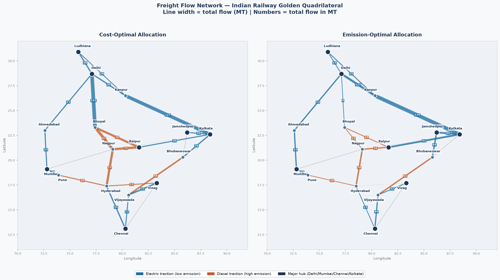
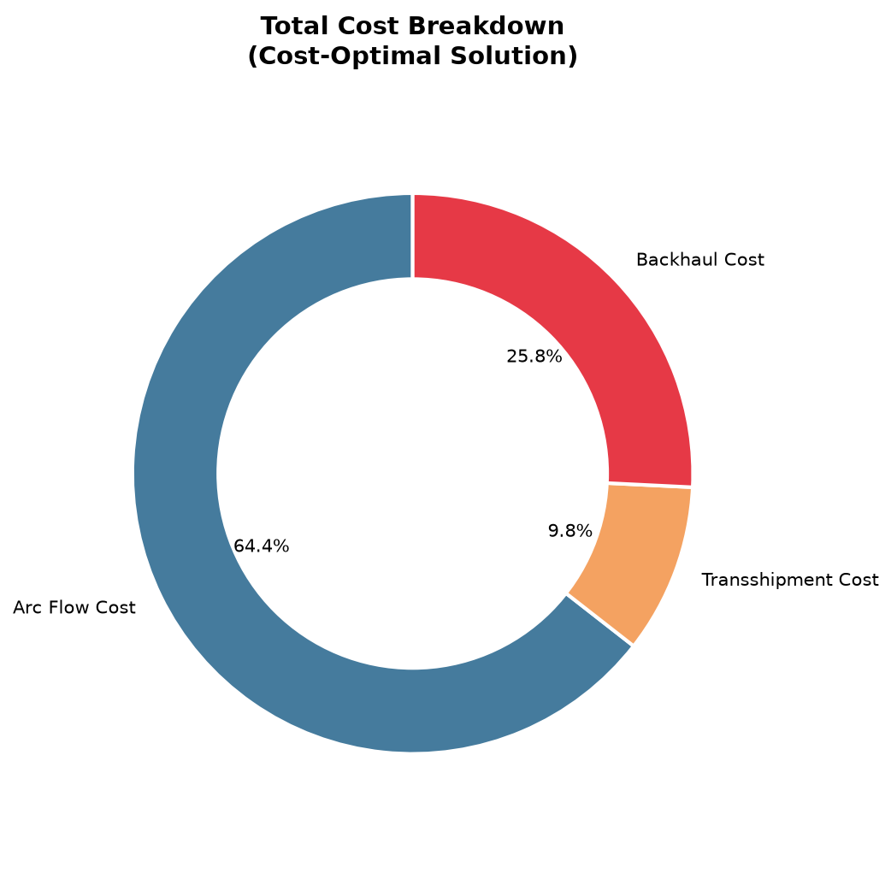

# CE 749 — Bi-Objective Freight Allocation Optimization
## Indian Railways Golden Quadrilateral Network




> **Bi-Objective Multi-Commodity Flow Optimization for Green Freight Allocation on Indian Railways: A Case Study of the Golden Quadrilateral Network**

---

## 🚀 What This Project Does

This project formulates and solves a **Bi-Objective Multi-Commodity Flow Linear Program (MCF-LP)** for optimizing annual freight allocation on the Indian Railways Golden Quadrilateral network.

**Two objectives minimized simultaneously:**
- **Z1** — Total logistics cost (arc flow + transshipment + backhaul) in Rs Crore
- **Z2** — Total CO₂ emissions in Million Tonnes (Mt-CO₂)

The **Pareto frontier** (12 non-dominated solutions) is generated using the **epsilon-constraint method**, revealing the cost-emission tradeoff.

---

## 📊 Key Results at a Glance

1. **8.66% emission reduction** is possible at a **15.45% cost premium** by optimally rerouting from diesel to electrified corridors.
2. **Backhaul costs** (empty wagon repositioning) constitute **25.8% of total logistics cost** — a critical hidden inefficiency.
3. **The Greedy Heuristic** emits **9.69% more** and costs **10.22% more** than the exact LP optimal, proving the value of optimization.
4. **Carbon breakeven price ≈ Rs 1,73,930 / tCO₂** — the point where green routing becomes cost-competitive.

---

## 🖥️ Interactive Dashboard

An interactive **Streamlit dashboard** is included, providing a no-code interface to explore the model results:

```bash
# Install all dependencies
pip install -r requirements.txt

# Launch the dashboard
streamlit run dashboard.py
```

Then open **http://localhost:8501** in your browser.

**Dashboard Pages:**
| Page | Description |
|---|---|
| 🏠 Overview | Live metric cards, key findings summary |
| 🎛️ Interactive Solver | Drag an emission-budget slider → LP solves instantly |
| 🗺️ Network Map | Geographic freight flow map, filterable by routing mode & commodity |
| 📈 Pareto Analysis | Full interactive Pareto chart + LP vs Greedy benchmark |
| 🔧 Sensitivity Analysis | Diesel capacity vs cost/emission curves |

---

## 💾 Project Structure

```
ce749/
├── data.py              — All input parameters (network, demand, costs, emissions)
├── model.py             — MCF-LP formulation + epsilon-constraint Pareto generator
├── heuristic.py         — Greedy Shortest Path benchmark
├── network_map.py       — Geographic network flow visualization
├── visualize.py         — Analytical figures (Pareto, flows, comparison, sensitivity)
├── standalone_figures.py — Run individual figures independently
├── main.py              — Master pipeline: runs everything end-to-end
├── dashboard.py         — Interactive Streamlit web dashboard
├── final_report.md      — End-to-end project report (Markdown)
├── report.tex           — Full LaTeX report (compile in Overleaf)
├── README.md            — This file
├── DATA_SOURCES.md      — All data values with citations
├── requirements.txt     — Python dependencies
├── LICENSE              — MIT License
└── outputs/             — Generated figures and results (created on run)
    ├── fig0_network_map.png
    ├── fig1_pareto_frontier.png
    ├── fig2_flow_distribution.png
    ├── fig3_heuristic_comparison.png
    ├── fig4_sensitivity.png
    ├── fig5_cost_breakdown.png
    ├── fig6_flow_comparison.png
    └── results_summary.json
```

---

## 🛠️ Installation & Usage

### Requirements
- Python 3.8+

```bash
# Install all dependencies
pip install -r requirements.txt
```

### Option 1: Run the full pipeline (generates all figures + JSON summary)
```bash
python main.py
```
**Expected runtime: ~6 seconds**

### Option 2: Launch the interactive dashboard
```bash
streamlit run dashboard.py
```

### Option 3: Run individual figures
```bash
python standalone_figures.py  # generates all figures
```

---

## 📐 Mathematical Formulation

**Decision variable:** `f[k][(i,j)]` = continuous flow of commodity `k` on arc `(i,j)` in MT.

**Objective 1: Minimize Total Cost (Z1)**
```math
Z_1 = \sum_{k, (i,j)} c_{k,ij} f_{k,ij} + \sum_{k, i} \tau_i t_{k,i} + \sum_{k, (i,j)} 0.4 \cdot r_k \cdot d_{ij} \cdot b_{k,ij}
```
*(Captures arc flow costs, transshipment charges, and backhaul penalties)*

**Objective 2: Minimize Total Emissions (Z2)**
```math
Z_2 = \sum_{k, (i,j)} \varepsilon_{k,ij} f_{k,ij}
```

**Constraints:**
1. Flow conservation at all nodes
2. Directional arc capacity
3. Transshipment tracking (through-flows)
4. Backhaul tracking (directional imbalances)

---

## 📈 Understanding the Output

### Cost Breakdown


- **Arc flow (64.4%)**: Standard freight tariff on corridors
- **Backhaul (25.8%)**: Empty wagon repositioning costs
- **Transshipment (9.8%)**: Marshalling yard detention charges

### Units Convention
| Variable | Internal Unit | Displayed Unit |
|---|---|---|
| Z1 (cost) | Rs (rupees) | ÷ 1e7 = **Rs Crore** |
| Z2 (emissions) | kgCO₂ | ÷ 1e9 = **Mt-CO₂** |
| Flow | MT (Million Tonnes) | — |

---

## 🌐 Network Overview

The network comprises **16 major nodes** covering the Golden Quadrilateral and its diagonals, representing **435 MT/year** of demand across 4 commodities (Coal, Cement, Foodgrains, Fertilizers).

| ID | City (Role) | ID | City (Role) |
|---|---|---|---|
| 1 | Delhi (Hub — NR zone) | 9 | Ahmedabad (WR industrial hub) |
| 2 | Mumbai (Hub — WR zone) | 10 | Kanpur (NCR junction - EDFC) |
| 3 | Chennai (Hub — SR zone) | 11 | Bhubaneswar (ECoR — coal origin) |
| 4 | Kolkata (Hub — ER zone) | 12 | Vijayawada (SCR east coast) |
| 5 | Nagpur (Central junction) | 13 | Raipur (SECL coal mines) |
| 6 | Bhopal (WCR junction) | 14 | Jamshedpur (Jharkhand steel belt) |
| 7 | Hyderabad (SCR junction) | 15 | Ludhiana (EDFC northern terminus) |
| 8 | Pune (CR junction) | 16 | Vizag (East coast port/fertilizer) |

---

## 📚 References

1. Malladi & Sowlati (2020). MCNF: State of the Art. *Operational Research*, Springer.
2. Sadykov et al. (2013). Freight Railcar Flow Problem. *ATMOS Workshop*.
3. Demir et al. (2019). Green Intermodal Freight. *Int'l J. Production Research*.
4. Ministry of Railways, GoI. *Indian Railways Year Book 2022-23*.
5. SFC India / IIM Bangalore. *India Default GHG Emission Values V1.0*, May 2025.
6. IEEFA. *Coal: A Heavy Burden on Indian Railways*, December 2023.

---
**Author:** Niraj | M.Tech IEOR, IIT Bombay (Roll No: 25M1528) | Course: CE 749
